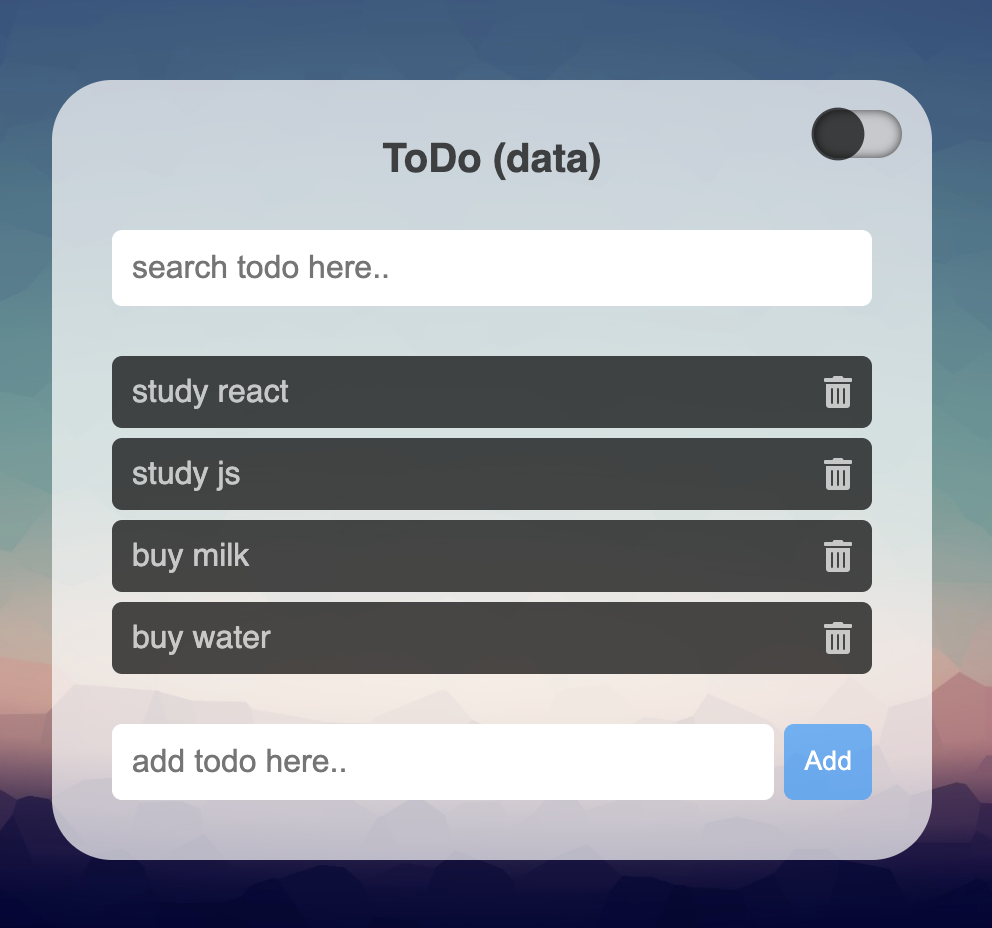
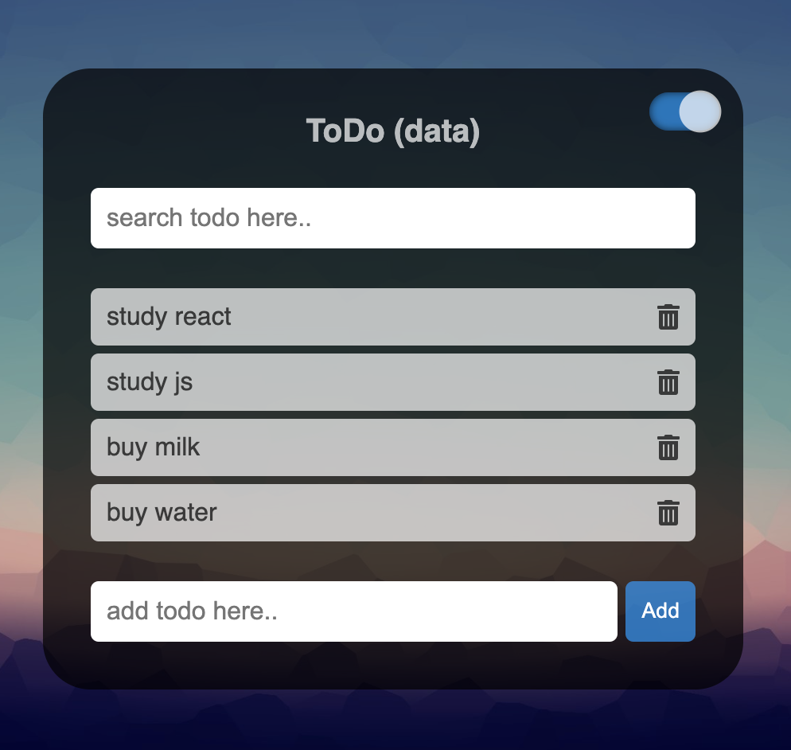

# pj__web-app__4-todo-app--database
## Info
- Title : Todo app (database)
- Author : JM WOO
- GitHub : https://github.com/jayxwoo/pj__web-app__4-todo-app--database
- Link : https://jayxwoo.github.io/pj__web-app__4-todo-app--database/
- Log : https://www.notion.so/4-Todo-app-database-60783abc7cf44964948334d40491b0c8

## Features
- Add todo - database(firebase)
- Delete todo - database(firebase)
- Search todo
- Dark mode

## Skills
- HTML
- CSS
- JS
    - DOM manipulation
    - CSS style manipulation
    - Event listener
    - JS modules
    - Firebase / Firstore
    - Filter array method

## Screenshots

